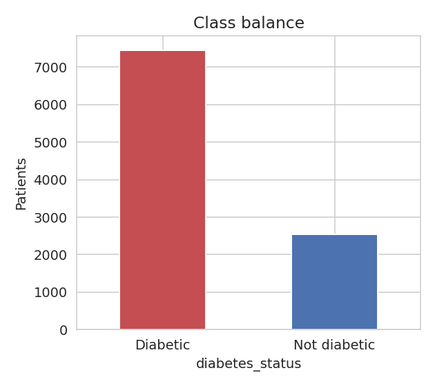
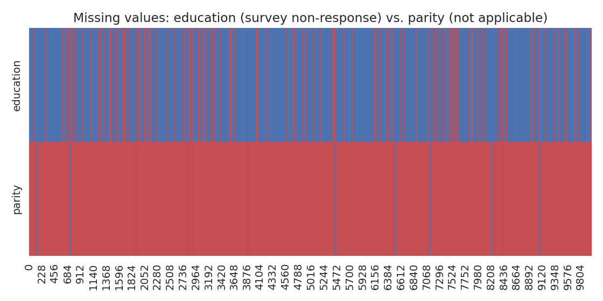
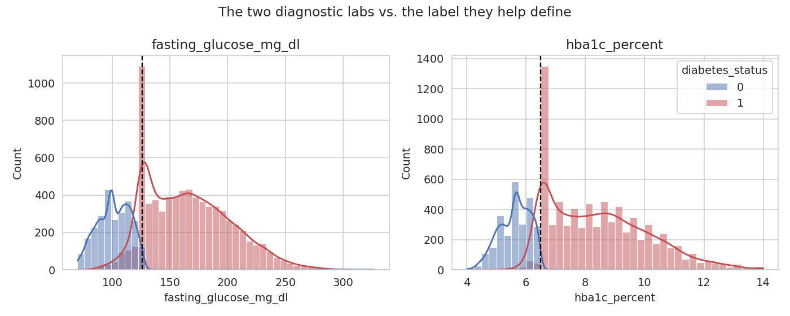
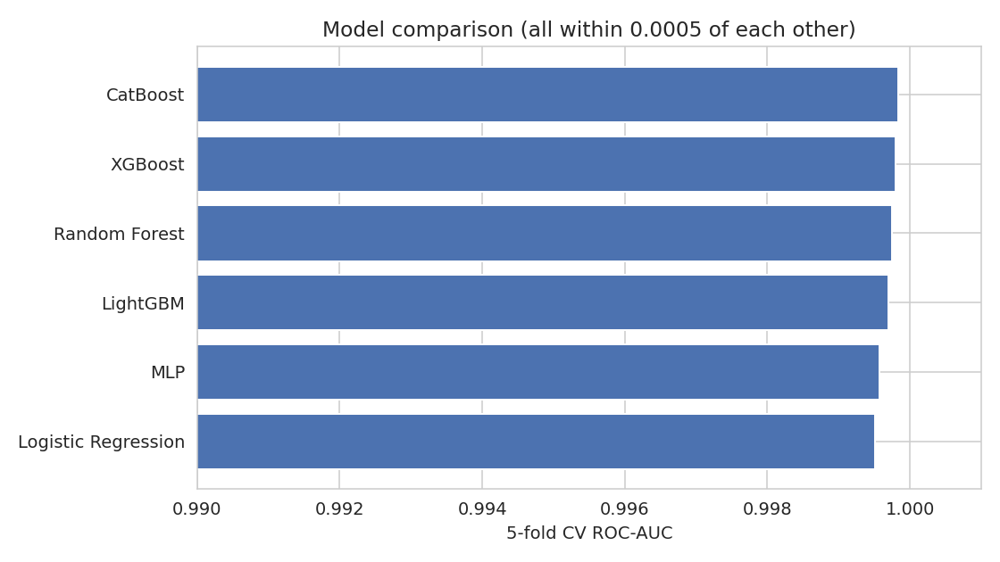
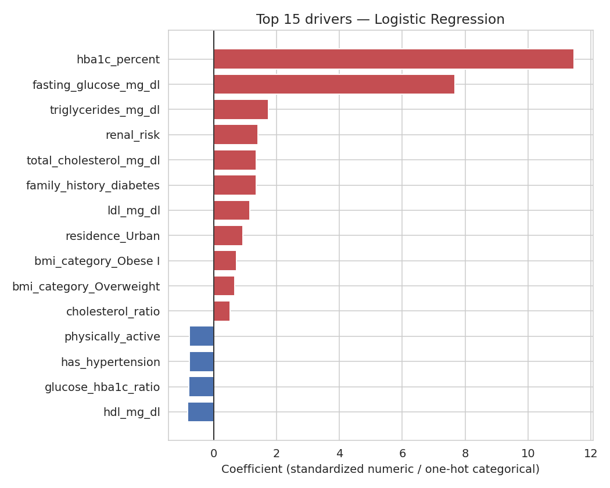
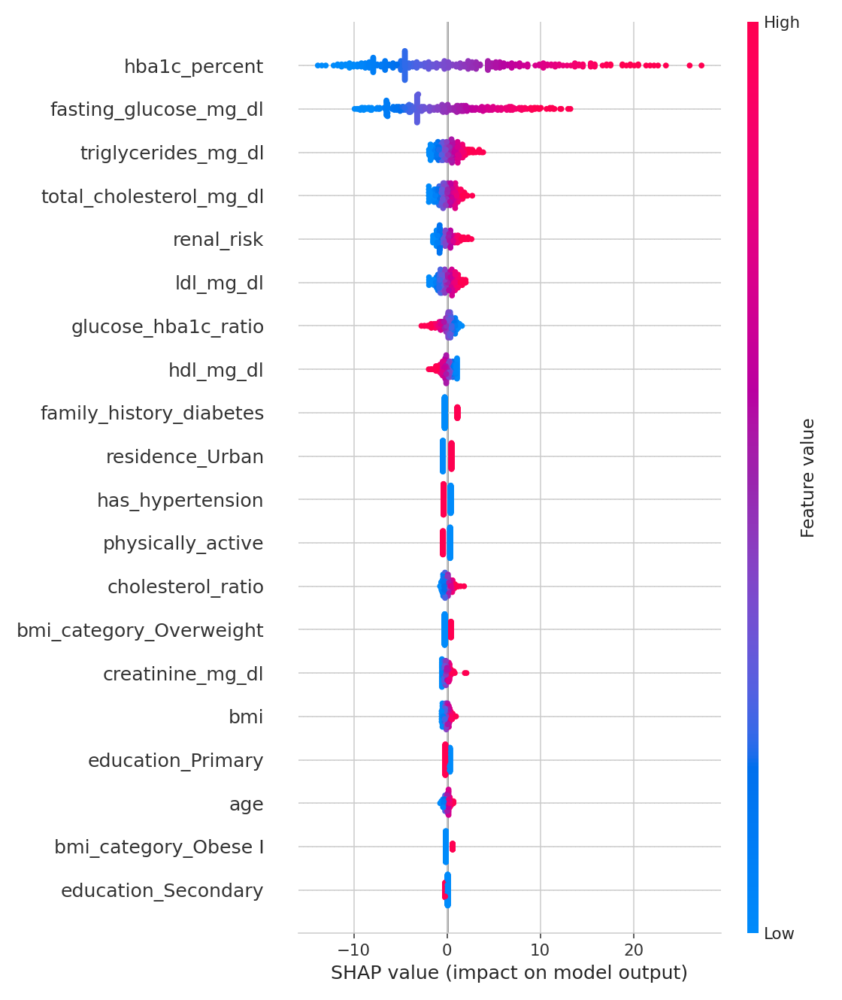
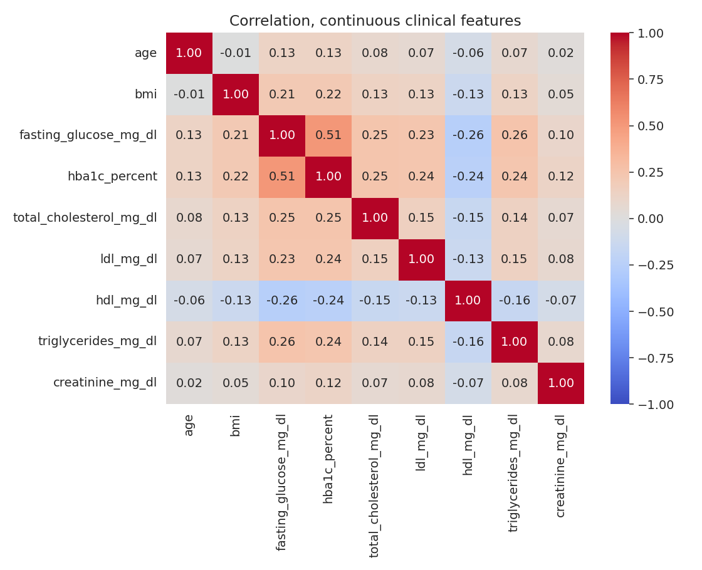

# Diabetes Risk Intelligence

A Type 2 diabetes screening/decision-support tool over a synthetic
10,000-patient dataset (demographics, behavioral factors, maternal history,
and lab panels) — leakage removal, SMOTE, a 6-model comparison, Optuna
tuning, and SHAP explainability, with a 5-page Streamlit dashboard.

| | |
|---|---|
| **Patients** | 10,000 |
| **Diabetic** | 74.6% (the majority class — see below) |
| **Model** | Logistic Regression |
| **CV ROC-AUC** | 0.9995 (all 6 models compared land within 0.0005 of this) |

## This is a rebuild, and here's why

The original pipeline was already fairly sophisticated — this isn't a case
of sloppy code. But re-running its own logic surfaced five real,
previously-undisclosed issues, in order of how much they actually mattered:

**1. Eight clinical risk factors were silently dropped from every model.**
`pandas.bool` is neither `np.number` nor `object`/`category`, so
`X.select_dtypes(include=np.number)` and
`X.select_dtypes(include=["object","category"])` — the original's entire
feature-selection logic — missed every boolean column. With
`ColumnTransformer`'s default `remainder="drop"`, that silently excluded
**family history, hypertension, PCOS, HIV status, physical activity,
previous GDM, previous macrosomia, and current pregnancy status** from all
six models compared. The Streamlit "Live Prediction" form asks a clinician
to enter all eight — every one of those inputs was cosmetic; the model
never learned from them. Confirmed by reproducing the original's exact
selection code and diffing the columns it picked against the real column
list. Fixed by casting them to `int` and including them explicitly.

**2. `parity` was imputed from the wrong population.** It's recorded for
exactly the 1.4% of rows where `is_pregnant == True` — everyone else
(including all 4,900 men) is `NaN` because the field doesn't apply, not
because it's missing. `SimpleImputer(strategy="median")` filled every one
of those with the median of the 142 pregnant rows (≈2), fabricating "2
prior pregnancies" as a feature value for every man in the dataset. Fixed:
impute 0 for anyone not currently pregnant.

**3. Optuna's hyperparameter tuning was a no-op.** `cross_validate(...,
scoring="roc_auc")` — a single string — returns its score under the key
`"test_score"`, not `"test_roc_auc"`. Every one of the 30 trials read
`scores["test_roc_auc"]`, raised `KeyError`, was caught by a blanket
`except Exception`, and returned `0.0`. All 30 trials tied at zero, so
Optuna's sampler had no signal to optimize against — `study.best_params`
was effectively arbitrary. Fixed by passing scoring as a dict, which keeps
the metric name in the result key; tuning now finds a real (if small,
this problem is already near its ceiling) improvement.

**4. The app's own dropdowns offered categories that don't exist in the
training data.** Education: the app offered `None`/`Tertiary`; the real
categories are `Primary`/`Secondary`/`Higher`. BMI category: the app
offered `Underweight`/`Obese`; the real categories are
`Normal`/`Overweight`/`Obese I`/`Obese II+`. `OneHotEncoder(handle_unknown
="ignore")` doesn't error on an unrecognized category — it silently
encodes it as all-zeros, so picking either mismatched option fed the model
no signal at all for that field, with no warning anything was wrong. Fixed
the dropdowns to match the real categories.

**5. A one-character operator-precedence bug in the app (not the training
script).** Both the Live Prediction and What-if Analysis pages computed:
```python
renal = creatinine * (1 if hypertension=="Yes" else 0 + 1)
```
Python's ternary binds looser than `+`, so this is `1 if hypertension=="Yes"
else (0+1)` — **both branches evaluate to 1.** `renal_risk` was always
`creatinine * 1` in the app, regardless of hypertension, even though the
training script's version of this feature correctly doubles it for
hypertensive patients. Every hypertensive patient scored through the app
<div align="center">

# Diabetes Risk Intelligence

<a href="https://git.io/typing-svg"></a>

<p><strong>A Streamlit decision-support dashboard for a synthetic 10,000-patient Type 2 diabetes dataset.</strong><br />
Compare models, inspect the data, run a patient scenario, and see why the model made its call.</p>

<p>
	<a href="https://www.python.org/"></a>
	<a href="https://streamlit.io/"></a>
	<a href="https://scikit-learn.org/"></a>
	<a href="LICENSE"></a>
</p>

<p><strong>Demo preview placeholder:</strong> add a short dashboard GIF or screenshot at <code>assets/dashboard-preview.gif</code>.</p>

</div>

> **Important:** This is a research and engineering project built on synthetic data. It is not a diagnosis, medical device, or substitute for clinical testing.

## Start here

```bash
git clone <your-repository-url>
cd diabetes-risk-screening
python -m venv .venv
```

Activate the environment, then install and launch:

```bash
# Windows PowerShell
.\.venv\Scripts\Activate.ps1

# macOS/Linux: source .venv/bin/activate
python -m pip install -r requirements.txt
streamlit run app.py
```

Open the local URL printed by Streamlit. The dashboard has five pages:

- [x] **Home**: model summary and the key caveat about the labels.
- [x] **Data Exploration**: class balance, missingness, distributions, and correlations.
- [x] **Model Performance**: held-out metrics, ROC curve, and confusion matrix.
- [x] **Live Prediction**: one patient scenario with a SHAP waterfall explanation.
- [x] **What-if Analysis**: change one factor and watch the estimated risk move.

<details>
<summary><strong>Rebuild the model and figures</strong></summary>

The serialized model artifacts are included, so the app runs immediately after installation. To rebuild them from the CSV:

```bash
python train_model.py
python generate_figures.py
```

`train_model.py` cleans the data, engineers features, compares six classifiers with stratified 5-fold cross-validation and in-fold SMOTE, tunes XGBoost with Optuna, and saves the deployed Logistic Regression pipeline plus its SHAP explainer.

</details>

## What is in the data?

The dataset contains demographics, behavior, pregnancy history, and clinical lab values. There are 10,000 rows, and 74.6% are labeled diabetic.



`parity` is recorded only for currently pregnant patients. Its 98.6% null rate is structural, not ordinary missing data; non-applicable rows are set to `0`. Survey-style missingness such as `education` is handled separately.



## The result needs a caveat

The label is almost directly recoverable from the two diagnostic labs included as model features. A simple rule, `fasting_glucose_mg_dl >= 126 OR hba1c_percent >= 6.5`, agrees with the dataset label 99.24% of the time.



So the headline scores below show that the pipeline recovers a known threshold rule. They do **not** prove that the model can screen someone before those tests are available. That would require a different feature set and a harder evaluation.

## Model comparison

Every candidate used the same preprocessing and stratified 5-fold cross-validation, with SMOTE inside each training fold.

| Model | Accuracy | Precision | Recall | F1 | ROC-AUC |
|---|---:|---:|---:|---:|---:|
| Random Forest | 0.9968 | 0.9999 | 0.9958 | 0.9979 | 0.9997 |
| CatBoost | 0.9964 | 0.9999 | 0.9953 | 0.9976 | 0.9998 |
| XGBoost | 0.9964 | 0.9993 | 0.9958 | 0.9976 | 0.9998 |
| LightGBM | 0.9960 | 0.9995 | 0.9952 | 0.9973 | 0.9997 |
| MLP | 0.9912 | 0.9957 | 0.9925 | 0.9941 | 0.9996 |
| **Logistic Regression (shipped)** | **0.9902** | **0.9974** | **0.9894** | **0.9934** | **0.9995** |



Logistic Regression ships because the models are effectively tied, while its coefficients are straightforward to audit and its SHAP explanations are exact and fast. Optuna tuning on XGBoost improved CV ROC-AUC from `0.99980` to `0.99982`, a real but small change.

## What the model uses

The pipeline removes post-diagnosis and complication fields, casts eight boolean risk factors explicitly, handles structural pregnancy fields correctly, and creates four derived features:

- `glucose_hba1c_ratio`
- `bmi_age_interaction`
- `cholesterol_ratio`
- `renal_risk`



HbA1c and fasting glucose dominate, which matches the label construction. Family history and `renal_risk` became visible after the boolean-column fix. The negative hypertension coefficient is a suppressor effect worth investigating, not a claim that hypertension is protective.



<details>
<summary><strong>Engineering notes from the rebuild</strong></summary>

- Boolean columns were silently excluded by the old `select_dtypes` split. They are now cast to integers and listed explicitly.
- `parity` is filled with `0` when pregnancy does not apply, instead of borrowing a median from 142 pregnant patients.
- Optuna now reads the named `roc_auc` score instead of swallowing a missing `test_roc_auc` key and returning zero for every trial.
- App dropdowns now match training categories: `Primary`/`Secondary`/`Higher` education and `Normal`/`Overweight`/`Obese I`/`Obese II+` BMI categories.
- The app and training code now calculate `renal_risk` consistently: `creatinine * (has_hypertension + 1)`.

</details>

## Repository map

```text
diabetes-risk-screening/
├── app.py                          # Five-page Streamlit dashboard
├── train_model.py                  # Cleaning, features, model comparison, tuning
├── generate_figures.py             # Rebuilds the charts in assets/
├── diabetes_production_model.pkl   # Saved imblearn pipeline and metrics
├── shap_explainer.pkl              # Explainer fitted to the deployed model
├── data/                            # Synthetic 10,000-patient CSV
├── notebooks/                       # Full EDA and modeling walkthrough
├── assets/                          # README charts and visual outputs
├── requirements.txt
└── LICENSE
```

<details>
<summary><strong>Reference: generated visual assets</strong></summary>



</details>

## License

MIT. See [LICENSE](LICENSE).
